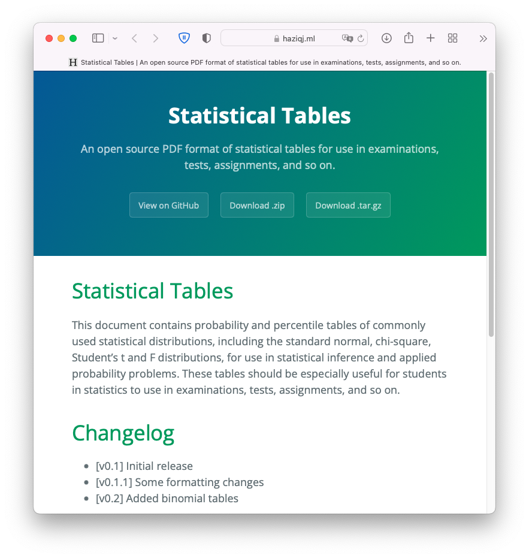
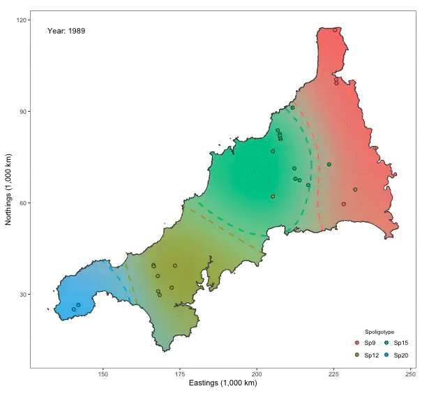

```{r setup, include = FALSE}
knitr::opts_chunk$set(echo = FALSE, fig.height = 8 / 2, fig.width = 16 / 2,
                      cache = TRUE, fig.path = "figure/", 
                      cache.path = "_cache/")
options(width = 70)  # if 4:3 set to 55, otherwise 70
library(tidyverse)
library(ggpubr)
library(cowplot)
library(ggrepel)
library(ggforce)
theme_set(theme_classic())
```

# Admin

## Getting started

### Admin

- Lecturer information

\vspace{-1.5em}

::: {.columns}

:::: {.column width=45%}
\footnotesize
```html
Dr. Haziq Jamil
Assistant Professor in Statistics
Room M1.09
haziq.jamil@ubd.edu.bn
```
::::

:::: {.column width=45%}
\footnotesize
```html
Dr. Huda Ramli
Lecturer in Applied Mathematics
Room M1.04
huda.ramli@ubd.edu.bn
```
::::


:::


\vspace{0.5em}

- \textcolor{solidpink}{\textbf{IMPORTANT: Read the syllabus.}}

- Weekly contact hours
    - \underline{Lectures}: 2 hours in ICTC Lab 7 on Thursdays 2:10 PM
    - \underline{Tutorials}: 2 hours in ICTC Lab 7 on Saturdays 2:10 PM

- Be aware of schedule and important deadlines.

- Check Canvas regularly for announcements and course materials.

## Module contents

### Module description

> Mathematical software is what bridges higher mathematics to real world applications. 
> On completing this module, students should be able to use `MATLAB` and `R` to effectively implement mathematical solutions to real world problems. 
> They should also be able to produce publication-quality mathematical documents using \LaTeX. 
> This module provides the computing skills required for an applied mathematics final year project.

\vspace{1em}

Contents

1. Learning `MATLAB` and `R` languages for mathematical applications.
2. `MATLAB` specific outomes: Basic operations, programming, numerical techniques and root finding.
3. `R` specific outcomes: Logic and types, data frames and matrices, data wrangling, and visualisations.
4. Preparation of report-style documents using \LaTeX.
5. Version control and social coding using Git and GitHub.

<!-- ### Reading list -->

<!-- - \fullcite{rosenthal2006first} -->
<!-- - \fullcite{billingsley2008probability} -->
<!-- - \fullcite{williams1991probability} -->
<!-- - \fullcite{walsh2012knowing} -->

### Assessment

Take note that this module is assessed wholly (100%) by coursework.

\vspace{0.5em}

*Formative assessment*

- Lab-based tutorials

*Summative assessment*

- **[20%]** 4 $\times$ online quizzes
- **[20%]** 2 $\times$ mini individual assignments
- **[30%]** 2 $\times$ mini group assignments
- **[30%]** 1 $\times$ project assignment with written report

\vspace{0.5em}
\pause

::: {.block}
#### A note on teams

- You may self-sign up to form teams (max in a group is 4).
- Peer evaluation after completion.
- Everyone is expected to contribute **equal effort**.

:::

### Collaboration, sharing and code reuse

<!-- Obtained from: http://sta323-sp22.github.io/ -->

- All graded assignments must be your own individual work, *except* for the group assignments (these are expected to be collaborative in nature). **Do not share your code, otherwise**.

- We are aware that the internet is a great resource. You may make use of any of these resources, but **you must explicitly cite where you obtained any code your directly use or use as inspiration in your solutions**.

- Any recycled code that is discovered and is not explicitly cited will be treated as plagiarism, regardless of source.

\pause

::: {.alertblock latex="{Penalties for plagiarism}"}


- A written, formal reprimand kept in Faculty records; and/or
- Resubmission of assignment; and/or
- Reduced assignment marks; and/or
- Fail grade for assignment.

:::


<!-- \textcolor{solidpink}{See the syllabus pdf file for further details.} -->

<!-- ### COVID-19 Information -->

<!-- *Information correct as of 16 December 2021* -->

<!-- - Staff and students must be fully vaccinated -->
<!-- - Negative ART results (to show result upon entry to FICOs) -->
<!-- - Green or Yellow code on Bruhealth -->
<!-- - Face masks must be worn at all times -->
<!-- - Body temperature less than 37.5 celsius -->
<!-- - Not displaying any symptoms of flu or COVID-19 -->

<!-- \vspace{1em} -->

<!-- - Room capacity at 75%  -->
<!-- - Lecturers to double mask and wear face shield -->
<!-- - No holding room available; advise to return home immediately if unwell -->

### Schedule

\footnotesize
\centering

\vspace{-1em}

\begin{tabular}[t]{rlll}
\toprule
Week & Topic & Instructor & Assessment\\
\midrule
\hspace{1em}W01: 01/08 -- 07/08 & Introduction \& Getting Started & NHR \& HJ & \\
\color{navyblue}
\hspace{1em}W02: 08/08 -- 14/08 & \color{navyblue}\texttt{[MATLAB]} Basic operations &\color{navyblue} NHR & \\

\color{navyblue}\hspace{1em}W03: 15/08 -- 21/08 & \color{navyblue}\texttt{[MATLAB]}\color{navyblue} Programming & NHR & \\

\hspace{1em} &\color{solidpink} \texttt{[R]} Introduction to R and Rstudio &\color{solidpink} HJ & Quiz 1\\

\hspace{1em}\multirow[t]{-2}{*}{\raggedleft\arraybackslash\color{solidpink} W04: 22/08 -- 28/08} & \texttt{[Git]} Git and GitHub & HJ & \\

\color{navyblue}\hspace{1em}W05: 29/08 -- 04/09 & \color{navyblue}\texttt{[MATLAB]} Numerical techniques & \color{navyblue}NHR & Quiz 2\\

\color{navyblue}\hspace{1em}W06: 05/09 -- 11/09 & \color{navyblue}\texttt{[MATLAB]} Root-finding & \color{navyblue}NHR & Individual 1 \\

\color{solidpink}\hspace{1em}W07: 12/09 -- 18/09 & \color{solidpink}\texttt{[R]} Logic and types & \color{solidpink}HJ & \\

\addlinespace[0.4em]
\color{gray}\hspace{1em}19/09 -- 25/09 & \color{gray}Mid-semester Break &  & \\
\addlinespace[0.4em]


\color{navyblue}\hspace{1em}W08: 26/09 -- 02/10 &\color{navyblue} \texttt{[MATLAB]} Peer review / presentations & \color{navyblue}NHR & Group 1\\

\color{solidpink}\hspace{1em}W09: 03/10 -- 09/10 &\color{solidpink} \texttt{[R]} Matrices and data frames & \color{solidpink}HJ & Quiz 3\\

\color{solidpink}\hspace{1em}W10: 10/10 -- 16/10 &\color{solidpink} \texttt{[R]} The tidyverse &\color{solidpink} HJ & \\

\color{solidpink}\hspace{1em}W11: 17/10 -- 23/10 & \color{solidpink}\texttt{[R]} Visualisations using ggplot &\color{solidpink} HJ & Individual 2\\

\color{myrtlegreen}\hspace{1em}W12: 24/10 -- 30/10 & \color{myrtlegreen}\texttt{[LaTeX]} Typesetting reports & \color{myrtlegreen}HJ & \\

\color{myrtlegreen}\hspace{1em}W13: 31/10 -- 06/11 & \color{myrtlegreen}\texttt{[LaTeX]} \color{myrtlegreen}Beyond reports &\color{myrtlegreen} NHR & Quiz 4\\

\color{solidpink}\hspace{1em}W14: 07/11 -- 13/11 & \color{solidpink}\texttt{[R]} Peer review & \color{solidpink}HJ & Group 2\\
\bottomrule
\end{tabular}


# Purpose of mathematical software

> Software is essential for modelling, analysing and calculating numeric, symbolic, or geometric data.

Generally speaking, mathematical software is very focused:

1. **Software calculator**: Performs simple mathematical operations.

2. **Computer algebra systems**: Designed to solve classical algebra equations and problems in human readable notation.

3. **Statistics**: Statistical analysis of data.

4. **Optimisation**: Selecting a best solution from a set of alternatives.

5. **Numerical analysis**: Numerical approximations for the problems of mathematical analysis.

6. etc.

::: {.block}
#### Remark

While mathematical software produces useful solutions, they very often do not explain \underline{why} the solutions are what they are.
:::

### How many primes are there? {.t}

\pause

::: {.theorem name="Euclid's Theorem"}
There are infinitely many primes.
:::


::: {.columns}

\pause

::: {.column width=48%}
- A prime number $p\in\bbN$ is divisible only by itself and 1.

- We might attempt to brute force the answer by writing a software loop.

- Can we prove this theorem by software?
:::

::: {.column width=48%}

\vspace{-1em}
\pause

```Markdown
INPUT n
  i := 2
  count := 0
  WHILE i <= n
    rem := n % i
    IF rem not equal to 0
      i := i + 1
      count := count + 1
    END IF
  END WHILE
OUTPUT count
```

:::

:::

### Software affords us insight

Let $\pi(x)$ be the prime counting function defined to be the number of primes less than or equal to $x$, for any $x\in\bbR$. Can we intuit a good approximation of $\pi(x)$?

\vspace{1em}
\pause

::: {.columns}

::: {.column width=48%}
\vspace{1em}


A different (but related) question: How far apart are the prime numbers?

\vspace{1em}
\pause

Define the *density* of primes as $\pi(x)/x$. 
This gives an idea of the distribution of primes up to $x$.
It would be interesting to map this out.

\vspace{1em}

\footnotesize
Source code from https://github.com/johnistan/ulam-spirals-R
:::

::: {.column width=48%}

\vspace{-1em}

```{r include = FALSE}
Ulam.Spiral<-function(N){
  if (N %% 2 == 0){
     cat(sprintf("Error: function only accepts odd integers because it a poorly written and fragile piece of code.\n"))
  }else{
m <- matrix(NA, nrow=(N), ncol=N)
    top.left<-c(1,1)
    bottom.right<-c(N,N)
    top.right<-c(1,N)
    bottom.left<-c(N,1)
    n<-N
    a<-N
    m[median(1:N),median(1:N)]<-1

while(a>=3){
# This is an adaptation of a Euler Problem 28 solution. It calculates the diaginals. 
    m[bottom.right[1],bottom.right[2]]<- a^2 #bottom right
    m[top.left[1],top.left[2]]<- a^2 - 2*a + 2 # top left
    m[top.right[1],top.right[2]]<- a^2 - 3*a + 3 # top right
    m[bottom.left[1],bottom.left[2]]<- a^2 - a + 1 #bottom left

#Both Horizontal Rows
    m[top.left[1],(top.left[2]+1):(top.right[2]-1)]<-seq( m[top.left[1],top.left[2]]-1,m[top.left[1],top.right[2]]+1) #Fill in top row
    m[bottom.left[1],(bottom.left[2]+1):(bottom.right[2]-1)]<-seq(m[bottom.left[1],bottom.left[2]]+1,  m[bottom.left[1],bottom.right[2]]-1) #Fill in bottom row
#Left Vertical Rows
    m[(top.left[1]+1):(bottom.left[1]-1), top.left[1]] <- seq(m[top.left[1],top.left[1]]+1,  m[bottom.left[1],top.left[1]]-1)#Left Hand Row
#Right Verical Row
   m[(top.right[1]+1):(bottom.right[2]-1),top.right[2]] <-seq(m[top.right[1],top.right[2]]-1 , m[top.right[1],top.right[2]] - (a-2) )
#drop down on square  and repeat
    a<-a-2
    top.left<-c(top.left[1]+1,top.left[2]+1)
    bottom.right<-c(bottom.right[1]-1,bottom.right[2]-1)
    top.right<-c(top.right[1]+1,top.right[2]-1)
    bottom.left<-c(bottom.left[1]-1,bottom.left[2]+1)
}
return(m)   
}
}
    
  
Prime.Marker<-function(N, ulamSpiral){
m <- matrix(NA, nrow=(N^2), ncol=4)
for (i in seq(N)) {
  for(j in seq(N)){
#    print(ulamSpiral[i,j])
    m[ulamSpiral[i,j],] <- c(ulamSpiral[i,j],j,i,IsPrime(ulamSpiral[i,j]))
  }
}
m <-as.data.frame(m)
colnames(m)<-c("n","x","y","p")
return(m)
}


#Prime Number Checker stolen from http://librestats.wordpress.com/2011/08/20/prime-testing-function-in-r/
#Thanks to librestats

IsPrime <- function(n){ # n=Integer you want to know if is/not prime
  if ((n-floor(n)) > 0){
    cat(sprintf("Error: function only accepts natural number inputs\n"))
  } else if (n < 1){
      cat(sprintf("Error: function only accepts natural number inputs\n"))
    } else
  # Prime list exists
  if (try(is.vector(primes), silent=TRUE) == TRUE){

    # Prime list is already big enough
    if (n %in% primes){
      TRUE
    } else
    if (n < tail(primes,1)){
      FALSE
    } else
    if (n <= (tail(primes,1))^2){
      flag <- 0
      for (prime in primes){
        if (n%%prime == 0){
          flag <- 1
          break
        }
      }

      if (flag == 0){
        TRUE
      }
      else {
        FALSE
      }
    }

    # Prime list is too small; get more primes
    else {
      last.known <- tail(primes,1)
      while ((last.known)^2 < n){
        assign("primes", c(primes,GetNextPrime(primes)), envir=.GlobalEnv)
        last.known <- tail(primes,1)
      }
      IsPrime(n)
    }
  } else {
    # Prime list does not exist
    assign("primes", PrimesBelow(n,below.sqrt=TRUE), envir=.GlobalEnv)
    IsPrime(n)
  }
}

# Get next prime
GetNextPrime <- function(primes){ # primes=Known prime list
  i <- tail(primes,1)
  while (TRUE){
    flag <- 0
    i <- i+2
    if (i%%6 == 3){
      flag <- 1
    }
    if (flag == 0){
      s <- sqrt(i)+1
      possible.primes <- primes[primes<s]
      for (prime in possible.primes){
        if ((i%%prime == 0)){
          flag <- 1
          break
        }
      }
      if (flag == 0){
        break
      }
    }
  }
  i
}

# Primes below specified integer n; optionally only those below sqrt(n)
PrimesBelow <- function(n, below.sqrt=FALSE){
  if (below.sqrt == TRUE){
    m <- ceiling(sqrt(n))
  } else {
    m <- n
  }

  primes <- c(2,3)
  i <- 3
  while (i < m-1){
    flag <- 0
    i <- i+2
    if (i%%6 == 3){
      flag <- 1
    }
    if (flag == 0){
      s <- sqrt(i)+1
      possible.primes <- primes[primes<s]
      for (prime in possible.primes){
        if ((i%%prime == 0)){
          flag <- 1
          break
        }
      }
      if (flag == 0){
        primes <- c(primes, i)
      }
    }
  }
  primes
}


    
    

#Demos

spiral<- Ulam.Spiral(5)
p<-Prime.Marker(5, spiral)


```


```{r, fig.align = "center", out.width = "80%"}
N <- 5
dat <- Prime.Marker(N, Ulam.Spiral(N))
ggplot(dat, aes(x, y, fill = p, label = n)) +
  geom_tile(stat = "identity") +
  geom_text(aes(col = p), size = 5) +
  coord_equal() +
  scale_fill_viridis_c(option = "magma", begin = 0.15, end = 0.95, 
                       direction = -1) +
  scale_colour_viridis_c(option = "magma", begin = 0.15, end = 0.95) +
  theme_void() +
  theme(legend.position = "none")
```

:::

:::


### Ulam's spiral

::: {.columns}

::: {.column width=40%}

- Prominent diagonal, horizontal and vertical lines containing large number of primes.

- Not unsurprising, as these correspond to certain prime-generating polynomials such as $x^2 - x + 41$ (Euler's).

- Nonetheless, connected to many unsolved areas of mathematics!

   - Riemann Hypothesis
   - Goldbach's conjecture
   - Twin prime conjecture
   - Legendre's conjecture

:::

::: {.column width=60%}

\vspace{-2em}

```{r, fig.align = "center", out.height = "90%"}
N <- 501
dat <- Prime.Marker(N, Ulam.Spiral(N))
ggplot(dat, aes(x, y, fill = p, label = n)) +
  geom_tile(stat = "identity") +
  coord_equal() +
  scale_fill_viridis_c(option = "magma", begin = 0.15, end = 0.95, 
                       direction = -1) +
  theme_void() +
  theme(legend.position = "none")
```

:::

:::

### Does the density converge?

As $x\to\infty$, the prime density $\pi(x)/x$ diminishes at a slow rate.
Reminiscent of an inverse logarithmic decrease!

\vspace{1em}

```{r warning = FALSE, fig.height = 3.4}
as_tibble(dat) %>%
  mutate(pix = cumsum(p),
         pixoverx = pix / n,
         ratio = pixoverx * log(n)) %>%
  # filter(n %in% c(10, 10^2, 10^3, 10^4, 10^5)) 
  filter(pix > 0) %>%
  ggplot(aes(n, pixoverx)) +
  geom_line(aes(n, 1 / log(n)), col = "red3") +
  geom_line() +
  scale_y_continuous(limits = c(0, 0.5), name = NULL) +
  scale_x_continuous(name = "x") +
  annotate("text", x = 250000, y = 0.05, label = expression(1/log(x)),
           col = "red3") +
  annotate("text", x = 250000, y = 0.12, label = expression(pi(x)/x))
```

### The prime number theorem

::: {.columns}

::: {.column width=49%}

- The *asymptotic* law of distribution of prime numbers states that
$$
\lim_{x\to\infty} \frac{\pi(x)/x}{1 / \log(x)} = \frac{\pi(x)}{x/\log(x)} = 1
$$
\pause

- From this, we have
$$
\pi(x) \sim \frac{x}{\log(x)}
$$

- We now have an approximation for the prime counting function, which improves as $x$ increases. In particular, $\lim_{x\to\infty} x / \log (x) = \infty$.

:::

::: {.column width=49%}
```{r warning = FALSE, message = FALSE, fig.width = 4}
dat2 <- tibble(
  n = 10 ^ (1:22),
  pix = c(4, 25, 168, 1229, 9592, 78498, 664579, 5761455, 50847534, 455052511, 4118054813, 37607912018, 346065536839, 3204941750802, 29844570422669, 279238341033925, 2623557157654233, 24739954287740860, 234057667276344607, 2220819602560918840, 21127269486018731928, 201467286689315906290)
) %>%
  mutate(pixoverx = pix / n,
         ratio = pixoverx * log(n))

as_tibble(dat) %>%
  mutate(pix = cumsum(p),
         pixoverx = pix / n,
         ratio = pixoverx * log(n)) %>%
  full_join(dat2) %>%
  filter(pix > 0) %>%
  ggplot(aes(n, ratio)) +
  geom_hline(yintercept = 1, linetype = "dashed", col = "grey50") +
  geom_line() +
  scale_x_log10(
    name = "x",
    breaks = scales::trans_breaks("log10", function(x) 10^x),
    labels = scales::trans_format("log10", scales::math_format(10^.x))
  ) +
  labs(y = expression(pi(x)/(x/log(x))))
```
:::

:::

### Using software

```{=latex}
\usetikzlibrary{arrows}

\begin{center}
\huge
\begin{tikzpicture}[->,node distance=6cm,thick,main node/.style={circle,draw}]

  \node[] (1) {\color{navyblue}Mathematics};
  \node[] (4) [right of=1] {\color{solidpink}\texttt{Software}};
  

  \path[]
    (1.north) edge[bend left] node [above] {\textit{ideation}} (4.north)
    (4.south) edge[bend left] node [below] {\textit{results}} (1.south);
    
\end{tikzpicture}
\end{center}
```

Use software as a tool to...

- Explore and visualise ideas

- Confirm ideas numerically

- Communicate results

### Beyond this course

Static websites served on GitHub; 3-D plots and animation; Plotting GIS shape files and maps; Reproducible research (`knitr`); Text processing and analysis; Web and social media scraping; Creating `R` packages; Web APIs; Parallel computing; Optimisation; Mathematical and statistical modelling

\vspace{1em}


```{r, out.width = "31%"}



```


<!-- \begin{figure}[htbp] -->
<!-- \centering -->
<!-- \includegraphics[width=.35\textwidth]{figure/beyond1.png} -->
<!-- \caption{Static websites served on GitHub} -->
<!-- \end{figure} -->

# Getting started

## Instructions

::: {.alertblock latex="{IMPORTANT}"}
Check Canvas for detailed instructions regarding software installation and sign up procedures.
:::

Important points:

- Use UBD e-mail in most cases to obtain Education Benefits

- Pick a suitable username (one that you won't be embarassed to use in a few years time!)

- Practice safe and secure passwords

- When using Lab PCs, best to create a personal folder and keep all your work files in there. 

- Recommended to use USB drives (make sure they're clean!) or some cloud service (Dropbox, Sharepoint, Google Drive, etc.)

## Software overview 


1. MATLAB--more details in the upcoming slides.

2. RStudio Desktop
   
   - RStudio is installed on campus computers.
   - It is free to install on your personal computers--https://www.rstudio.com/products/rstudio/download/
   - You may also need to install the `R` language too, depending on your system. Do a Google search for 'R Windows download' or similar.

3. Git, github.com and GitHub Desktop 

   - Please sign up for an account at github.com/signup using your UBD e-mail.
   - You will be invited to join the course organization (`sm2302`) in due course.
   - Assignments will be distributed and collected via GitHub.

4. Overleaf.com

   - Please sign up for an account at https://www.overleaf.com/register


